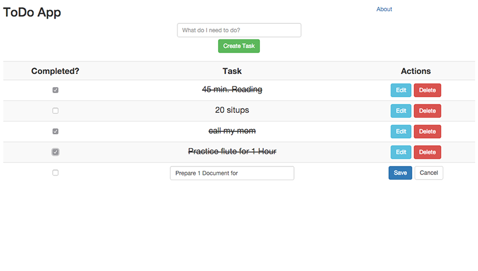

# SuperMeanStack
Sample Project Todo List Using Angular, Node/Express, Webpack, MongoDB, SASS, Babel/ES6, Bootstrap


------------------

## Using this project

```bash
$ npm install 
```

Then run:

```bash
$ npm start & webpack-dev-server 
```
